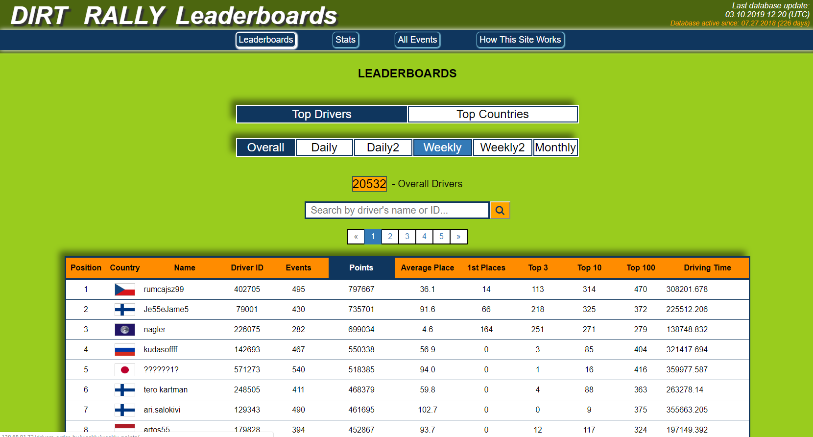

# DirtRallySiteProject

Link to my project website: http://138.68.81.72/drivers_order_by/overall/overall_points/ 

Official Dirt Rally site for web scraping: https://www.dirtgame.com/us/events

 

### Short annotation about this site:

This hobby project includes competition statistics database and website for Dirt Rally racing simulator. The website is published and currently used by Dirt Rally clients. At the base of the project is data scraping from the game’s official website. Python and Django framework are used for back-end programming. PostgreSQL as database and DigitalOcean as cloud service on Ubuntu operating system. HTML, CSS and JavaScript are used for front-end design. 

This project emerged from my hobby - esports racing simulator (simulator/game - Dirt Rally).

The reason I made this leaderboards site is lack of statistics an rankings at the official Dirt Rally website. There for it is quite hard to valuate competitors by their skill level. On the original website, there are no appropriate long term leaderboards or ranks to determine the fastest or most stable competitors. On this project's website I have accumutaled data and statistics for top 1st place, in top 3 places, in top 10 places finishers and many other statistics. The same all statiscics have been calculated by countries also.  

This site will scrap all completed events information from official site and upload it on the server.

I taught myself programming and web development by making this site.

In upper right corner of the site you can see "Database active since: 07.27.2018". It is date, I started working on this site
and scraping official events data. So the oldest Daily and Daily 2 event on this site is from 07.27.2018.

