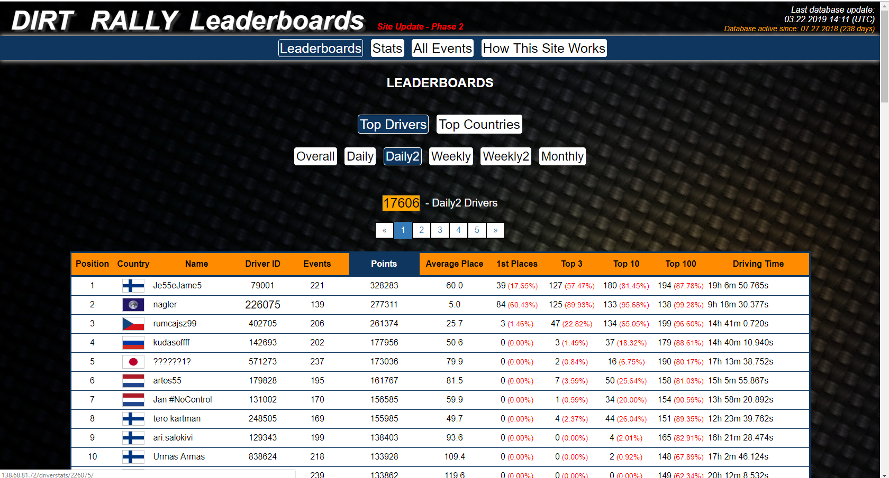

# DirtRallySiteProject

Link to project website: http://138.68.81.72/drivers_order_by/overall/overall_points/ 

Official Dirt Rally site: https://www.dirtgame.com/us/events

 

### Short annotation about this site:

This project emerged from my hobby - simracing (simulator/game - Dirt Rally)

The reason I made this leaderboards site was due to inability to determine drivers' skills 
or proficiency by visiting the official Dirt Rally website. There was no ranks or leaderboards to determine the fastest 
or the most stable driver. Or who has finished in Top 10 or top 100 more times than any other driver. 

This site will scrap all completed events information from official site and upload it on the server.

I taught myself programming and web development by making this site. Some areas of the site may still be under development.

In upper right corner of the site you can see "Database active since: 07.27.2018". It is date, I started working on this site
and scraping official events data. So the oldest Daily and Daily 2 event on this site is from 07.27.2018.

